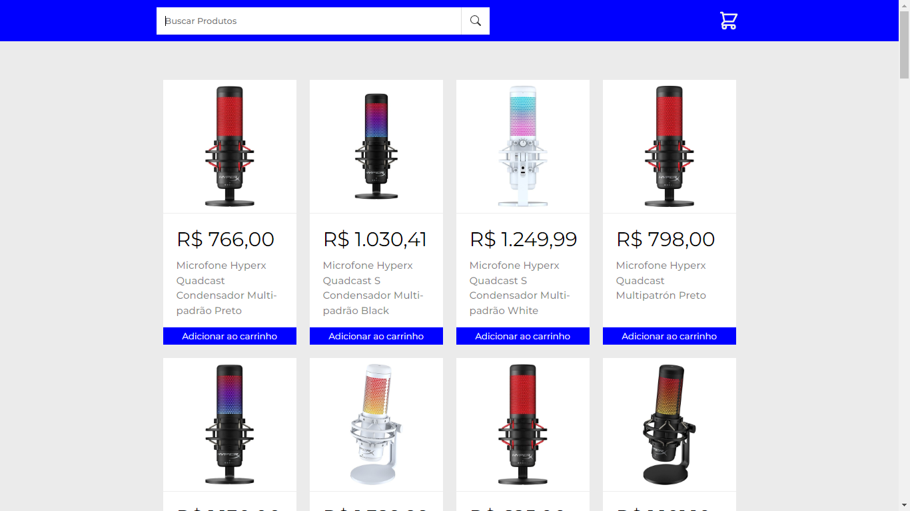
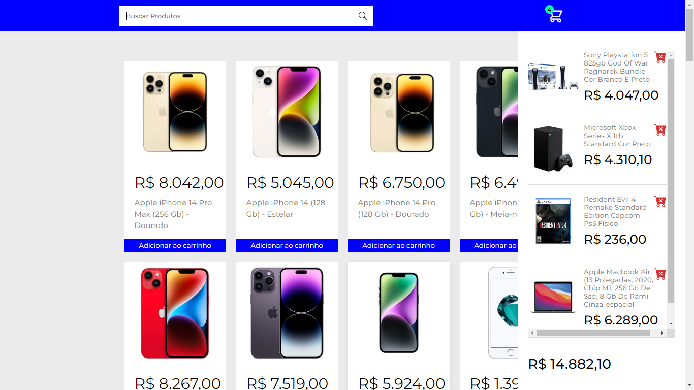
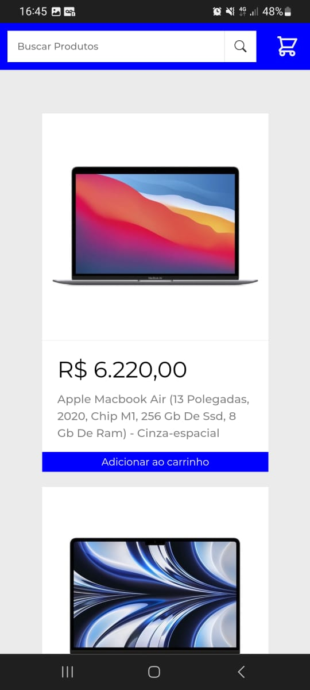
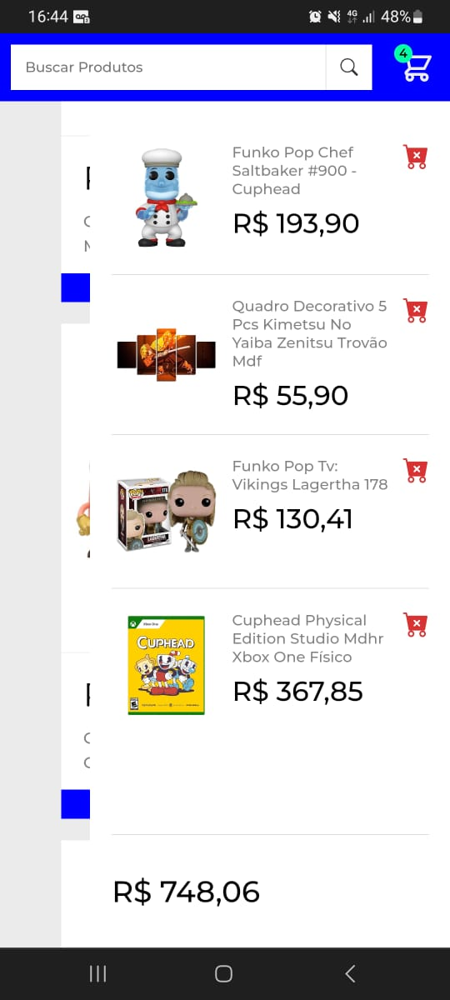

<h1 align="center">Carrinho de compras</h1>

<h2 align="center">Versão Desktop</h2>

  <h3 align="center">Resultado da pesquisa</h3>

  

  <h3 align="center">Carrinho de compras aberto</h3>
  
  

#

<h2 align="center">Versão Mobile</h2>

<h3 align="center">Resultado da pesquisa</h3>

    

<h3 align="center">Carrinho de compras aberto</h3>

    

#

## Tecnologias

Para desenvolver esse projeto eu utilizei as seguintes tecnologias:
 

- React, JavaScript, HTML e CSS.

## Projeto

Um Website conceitual para buscar e adicionar produtos ao carrinho de compras.

## Deploy

Link para acessar o projeto: https://shopping-cart-six-phi.vercel.app/
